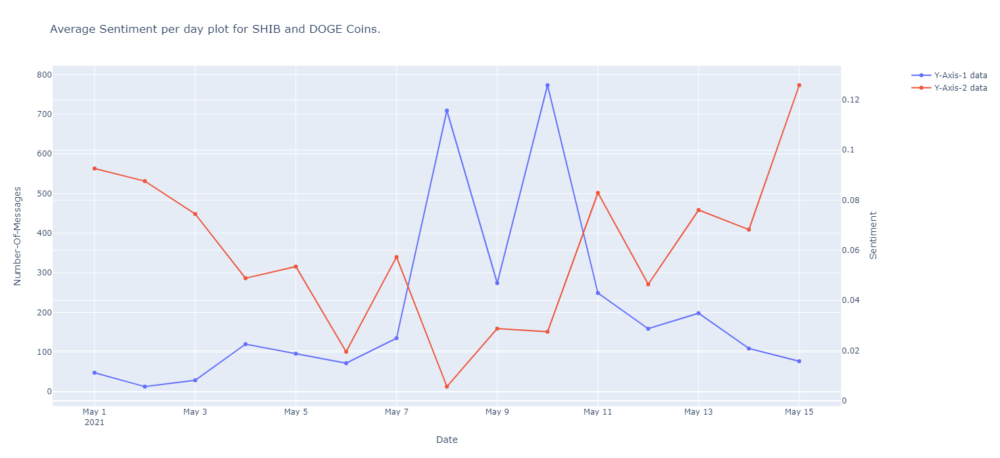

# CryptoSentimentAnalysis
Sentiment Analysis for Doge and Shib Coins
 This project deals with sentiment analysis of telegram messages on crypto.com channel. The messages are from 1st May to 15th May, 2021 which was highly volatile period for Crypto 
 Currency.

# Summary of results

 
 
 
The plot shows that the average sentiment has been neutral and the volume of message have been high on days when there were outages on Crypto.com and there was high volatility. Furthermore there seems to be a correlation between sentiment, market value and volume of trade for the coins for a day. 

# Choice of Sentimemnt Analysis approach

1. Pre-Processing:

   A. Removal of white spaces.Here I have not converted text to lowercase as case of the text can convey emphasis information.
      Next step was to consider only those messages referring to DOGE or SHIB coins.
      
   B. Furthermore, messages were tokenized, stemmed (representing words in their root form) and lemmatized (representing related words in dictionary). 
      Only english language messages were considered, rest messages were removed.
      
2. Sentiment Analysis:
   I decided to use VADER (Valence Aware Dictionary and Sentiment Reasoner) for sentiment analysis. VADER is a lexicon and rule-based sentiment analysis tool, specifically 
   attuned to sentiments expressed in social media.
   It works well sentiment of a text containing emoticons, slangs, conjunctions, capital words and punctuations. Vader is part of NLTK library.
   
# Instructions to run the code

1. Create virtual Environment

2. Install requirements pip install -r requirements.txt

3. Run App 
   
   python main.py

